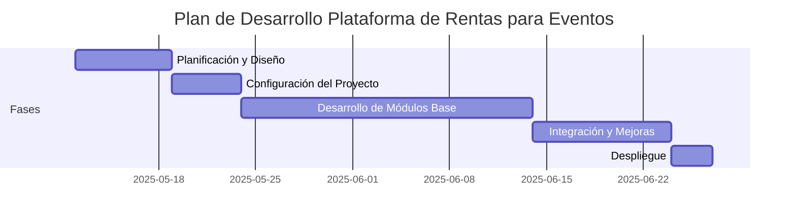
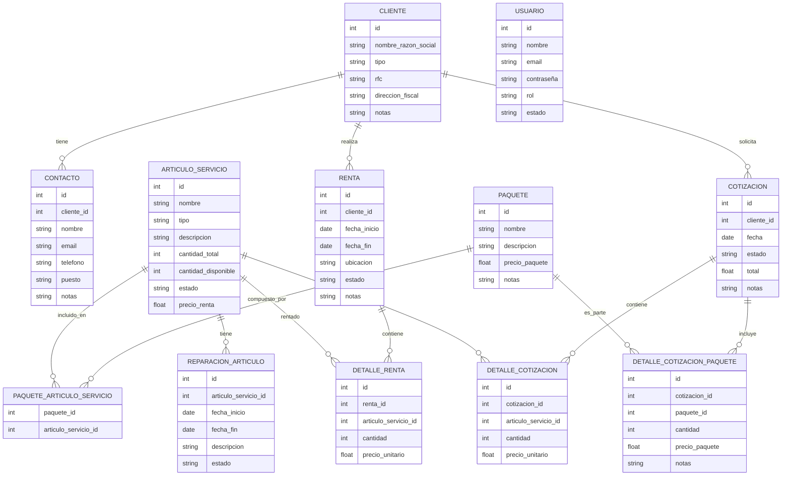

# Proyecto: Plataforma de Rentas para Eventos

## Resumen del Proyecto
Plataforma web para empresas de renta de servicios y artículos para eventos (audiovisuales, bodas, pistas de baile, decoración, flores, mobiliario, etc). Permitirá gestionar clientes, inventario, agenda, cotizaciones, contratos, reportes y usuarios.

## Objetivos
- Digitalizar y optimizar la gestión de rentas de eventos.
- Facilitar el seguimiento de clientes, artículos y servicios.
- Automatizar la generación de cotizaciones y contratos.
- Mejorar la administración de inventario y agenda.

## Tecnologías
- **Frontend:** Astro JS
- **Backend:** Laravel
- **Base de datos:** MySQL o PostgreSQL
- **Comunicación:** API REST

## Estructura Inicial del Proyecto
```
crm-project/
├── backend/        # Laravel
├── frontend/       # Astro JS
├── project-idea/   # Imágenes y documentos de referencia
└── PROJECT-PLAN.md
```

## Fases y Diagrama de Gantt

| Fase | Descripción                | Estado | Fecha Inicio | Fecha Fin |
|------|----------------------------|--------|--------------|-----------|
| 1    | Planificación y Diseño     | 🟦     | 2025-05-12   |           |
| 2    | Configuración del Proyecto | ✅     | 2025-05-12   | 2025-05-13 |
| 3    | Desarrollo de Módulos Base | 🟦     | 2025-05-12   |           |
| 4    | Integración y Mejoras      | ⬜     |              |           |
| 5    | Despliegue                 | ⬜     |              |           |

**Leyenda:** ⬜ Pendiente | 🟦 En Progreso | ✅ Terminado

## Progreso por Fase

### Fase 1: Planificación y Diseño
- Objetivos, alcance y tecnologías definidos en `PROJECT-PLAN.md`.
- Estructura de carpetas y cronograma establecida.
- Diagrama ER y modelos principales documentados.
- Pendiente (opcional): agregar requerimientos no funcionales y flujos de usuario para mayor detalle.

### Fase 2: Configuración del Proyecto
- Repositorio y estructura de carpetas inicializada.
- Backend (Laravel) instalado y funcional, con migraciones, factories y seeders verificados.
- Base de datos conectada y operativa.
- Frontend (Astro JS) inicializado y listo para desarrollo.
- Instrucciones de instalación y arranque documentadas en `README.md`.

### Requerimientos No Funcionales
- **Rendimiento:** El backend debe responder a solicitudes API en menos de 500ms bajo carga normal. El frontend debe cargar la vista inicial en menos de 2 segundos.
- **Seguridad:** Uso de variables de entorno para credenciales; protección CSRF y CORS en backend; sanitización de entradas.
- **Escalabilidad:** La arquitectura permite agregar nuevos módulos y entidades sin refactorización mayor.
- **Mantenibilidad:** Código documentado y estructurado por módulos; uso de control de versiones y convenciones de Laravel/Astro.
- **Usabilidad:** Interfaz intuitiva y accesible; navegación clara entre módulos.
- **Portabilidad:** El proyecto puede desplegarse en cualquier entorno compatible con PHP 8+ y Node.js 18+.

### Diagrama de Gantt (Ejemplo Markdown)



## Módulos y Funcionalidades

### 1. Gestión de Clientes
- Alta, edición y baja de clientes. **(Completado: integración frontend-backend, formulario, edición y eliminación en línea, validación y actualización instantánea)**
- Búsqueda y filtrado de clientes. *(Pendiente)*
- Visualización de historial de rentas/cotizaciones por cliente. *(Pendiente)*
- Gestión de datos de contacto y notas. *(Parcial)*

#### Avances recientes (2025-05-13)
- CRUD de clientes 100% funcional desde la interfaz web.
- Edición y eliminación en línea conectadas a la API.
- Validaciones y mensajes de error claros para el usuario.
- Mejoras de usabilidad y actualización instantánea de la tabla.

### 2. Gestión de Artículos y Servicios
- Alta, edición y baja de artículos/servicios.
- Clasificación por tipo (audio, mobiliario, decoración, etc.).
- Control de inventario y disponibilidad.
- Registro de reparaciones y mantenimiento.
- Reporte de disponibilidad y stock.

### 3. Gestión de Rentas/Eventos
- Creación y edición de rentas/eventos.
- Asignación de artículos y servicios a cada renta.
- Fechas, horarios y ubicación del evento.
- Estado de la renta (pendiente, confirmada, entregada, finalizada, cancelada).
- Conversión de cotizaciones en contratos.

### 4. Agenda y Calendario
- Visualización de eventos/rentas en calendario.
- Gestión de fechas ocupadas y disponibles.
- Recordatorios y notificaciones de eventos próximos.

### 5. Cotizaciones y Contratos
- Generación de cotizaciones personalizadas.
- Edición y conversión de cotizaciones a contratos.
- Historial y seguimiento de cotizaciones.
- Descarga/impresión de documentos.

### 6. Reportes
- Reporte de disponibilidad de artículos.
- Reporte de ingresos y rentas por periodo.
- Reporte de clientes frecuentes y artículos más rentados.

### 7. Gestión de Usuarios y Roles
- Alta, edición y baja de usuarios del sistema.
- Asignación de roles y permisos (administrador, vendedor, operador, etc.).
- Control de acceso a módulos según rol.

### 8. Panel de Inicio / Dashboard
- KPIs principales (rentas activas, ingresos, artículos disponibles, etc.).
- Accesos rápidos a módulos clave.
- Notificaciones y alertas importantes.

### 9. Ayuda y Soporte
- Acceso a video-ayudas o manuales.
- Sección de preguntas frecuentes.

## Modelos de Datos

### Diagrama Visual de Entidades y Relaciones



### Entidades Principales

1. **Cliente**
   - id
   - nombre o razón social
   - tipo (Persona Moral / Persona Física)
   - rfc
   - dirección fiscal
   - notas

2. **Artículo/Servicio**
   - id
   - nombre
   - tipo (audio, mobiliario, decoración, etc.)
   - descripción
   - cantidad_total
   - cantidad_disponible
   - estado (activo, en reparación, dado de baja)
   - precio_renta

3. **Renta/Evento**
   - id
   - cliente_id (relación con Cliente)
   - fecha_inicio
   - fecha_fin
   - ubicación
   - estado (pendiente, confirmada, entregada, finalizada, cancelada)
   - notas

4. **Detalle de Renta**
   - id
   - renta_id (relación con Renta)
   - articulo_id (relación con Artículo/Servicio)
   - cantidad
   - precio_unitario

5. **Cotización**
   - id
   - cliente_id
   - fecha
   - estado (pendiente, aceptada, rechazada, convertida)
   - total
   - notas

6. **Detalle de Cotización**
   - id
   - cotizacion_id
   - articulo_id
   - cantidad
   - precio_unitario

7. **Detalle de Cotización de Paquetes**
   - id
   - cotizacion_id (relación con Cotización)
   - paquete_id (relación con Paquete)
   - cantidad
   - precio_paquete
   - notas

7. **Usuario**
   - id
   - nombre
   - email
   - contraseña
   - rol (admin, vendedor, operador, etc.)
   - estado

8. **Contacto**
   - id
   - cliente_id (relación con Cliente)
   - nombre
   - email
   - teléfono
   - puesto / relación
   - notas

9. **Paquete**
   - id
   - nombre
   - descripción
   - precio_paquete
   - notas

10. **Reparación de Artículo**
   - id
   - articulo_id
   - fecha_inicio
   - fecha_fin
   - descripción
   - estado

### Integración de Paquetes en Cotizaciones

Las cotizaciones pueden incluir tanto artículos/servicios individuales como paquetes completos. Para esto, existen dos tablas de detalle:
- **Detalle de Cotización:** para artículos/servicios individuales.
- **Detalle de Cotización de Paquetes:** para paquetes completos.

Al crear una cotización:
- El usuario puede agregar artículos y/o paquetes.
- El sistema debe mostrar el desglose de cada paquete (artículos incluidos).
- El total se calcula sumando los artículos individuales y los paquetes seleccionados.
- El precio de cada paquete se guarda en el detalle, permitiendo promociones o cambios futuros.

Ventajas:
- Flexibilidad para cotizar solo artículos, solo paquetes, o ambos.
- Permite promociones y combos fácilmente.
- Facilita la trazabilidad y análisis de ventas de paquetes.

### Relaciones Básicas

- Un **Cliente** puede tener muchos **Contactos**.
- Un **Cliente** puede tener muchas **Rentas** y **Cotizaciones**.
- Una **Renta** puede tener muchos **Artículos/Servicios** (a través de Detalle de Renta).
- Un **Artículo/Servicio** puede estar en muchas **Rentas** y **Cotizaciones**.
- Un **Artículo/Servicio** puede tener muchas **Reparaciones**.
- Un **Paquete** puede tener muchos **Artículos/Servicios** (relación muchos a muchos).
- Un **Artículo/Servicio** puede pertenecer a muchos **Paquetes**.
- Un **Usuario** puede crear/modificar **Rentas**, **Cotizaciones**, **Clientes**, etc. (según permisos).

## Recursos de Referencia
- Imágenes y documentos en `/project-idea`

## Avances Recientes (12 mayo 2025)

- **Migraciones completadas:** Todas las tablas principales y pivote creadas con relaciones correctas (clientes, contactos, artículos/servicios, paquetes, rentas, cotizaciones, reparaciones, etc.).
- **Factories personalizados:** Implementados para todos los modelos clave, generando datos de prueba realistas y variados.
- **Seeders implementados y verificados:** Seeders poblando la base de datos con datos coherentes y relaciones entre entidades (clientes con contactos, rentas con detalles, cotizaciones con artículos y paquetes, etc.).
- **Base de datos poblada exitosamente:** Proceso de `migrate:fresh --seed` ejecutado sin errores, validando la integridad de las relaciones y la lógica de los seeders.
- **Próximos pasos:** Pruebas unitarias, endpoints API, integración frontend y nuevas funcionalidades.

## Notas
- Actualiza este archivo conforme avances.
- Marca el estado de cada fase en la tabla de Gantt.
- Agrega detalles o ideas nuevas en cada sección según sea necesario.
