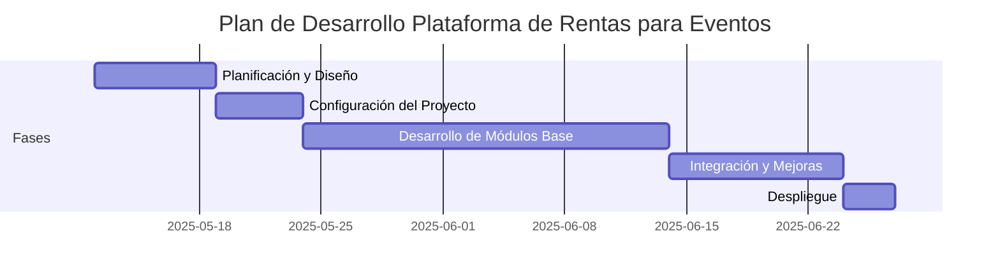

# Proyecto: Plataforma de Rentas para Eventos

## Resumen del Proyecto
Plataforma web para empresas de renta de servicios y artículos para eventos (audiovisuales, bodas, pistas de baile, decoración, flores, mobiliario, etc). Permitirá gestionar clientes, inventario, agenda, cotizaciones, contratos, reportes y usuarios.

## Objetivos
- Digitalizar y optimizar la gestión de rentas de eventos.
- Facilitar el seguimiento de clientes, artículos y servicios.
- Automatizar la generación de cotizaciones y contratos.
- Mejorar la administración de inventario y agenda.

## Tecnologías
- **Frontend:** Astro JS
- **Backend:** Laravel
- **Base de datos:** MySQL o PostgreSQL
- **Comunicación:** API REST

## Estructura Inicial del Proyecto
```
crm-project/
├── backend/        # Laravel
├── frontend/       # Astro JS
├── project-idea/   # Imágenes y documentos de referencia
└── PROJECT-PLAN.md
```

## Fases y Diagrama de Gantt

| Fase | Descripción | Estado | Fecha Inicio | Fecha Fin |
|------|-------------|--------|--------------|-----------|
| 1    | Planificación y Diseño        | ⬜ |            |           |
| 2    | Configuración del Proyecto    | ⬜ |            |           |
| 3    | Desarrollo de Módulos Base    | ⬜ |            |           |
| 4    | Integración y Mejoras         | ⬜ |            |           |
| 5    | Despliegue                    | ⬜ |            |           |

**Leyenda:** ⬜ Pendiente | 🟦 En Progreso | ✅ Terminado

### Diagrama de Gantt (Ejemplo Markdown)



## Módulos Principales
- Gestión de clientes
- Gestión de artículos/servicios
- Agenda de eventos
- Cotizaciones y contratos
- Reportes
- Gestión de usuarios
- Panel de inicio con KPIs

## Recursos de Referencia
- Imágenes y documentos en `/project-idea`

## Notas
- Actualiza este archivo conforme avances.
- Marca el estado de cada fase en la tabla de Gantt.
- Agrega detalles o ideas nuevas en cada sección según sea necesario.
